[toc]

### 为什么需要分布式锁
> 在谈分布式锁之前，我们必须要知道，我们为什么需要分布式锁？

与分布式锁对应的是**单机锁**，我们在写多线程程序的时候，为了避免同时操作同一个共享变量产生数据问题，通常会使用一把🔒来**进行互斥**，以保证共享变量的正确性，其使用范围是在**同一个进程**中。

如果换做是多个进程，需要同时操作一个共享资源，如何互斥呢？

例如，现在的业务应用通常都是微服务架构，这也意味着一个应用会部署多个进程(见下图1所示)，那这多个进程如果需要修改MySQL中的同一行记录时，为了避免操作乱序导致数据错误，此时，我们就需要引入**分布式锁🔒**来解决这个问题了。


要想实现分布式锁，必须借助一个外部系统，所有进程都去这个系统上去**申请加锁🔒**。

而这个外部系统，必须实现**互斥**的能力，即两个请求进来，只会给一个进程返回成功，另一个返回失败(或者等待)。

这个外部系统，可以是 MySQL, 也可以是 Redis 或 Zookeeper。但为了追求更高的性能，我们通常都会选择是用 Redis 或 Zookeeper 来做。

下面我们就以 Redis 为主线，由浅入深，来一起探讨分布式锁的各种**安全问题**，彻底理解分布式锁🔒。

### Redis如何实现分布式锁
> 让我们先从最简单的开始说起...

想要实现分布式锁🔒，必须要求 Redis 有**互斥**的能力，我们可以使用 `SETNX` 命令，这个命令表示 `SET if Not eXist`, 即如果 Key 不存在，才会设置它的值，否则什么也不做。

两个客户端进程可以执行这个命令，达到互斥，就可以实现一个分布式锁🔒。

客户端1申请加锁，加锁成功:
```
127.0.0.1:6379> SETNX lock 1
(integer) 1  // 客户端1，加锁成功
```

客户端2申请加锁，加锁成功:
```
127.0.0.1:6379> SETNX lock 1
(integer) 0  // 客户端2，加锁失败
```
因此，加锁成功的客户端，就可以去操作**共享资源**，例如，修改MySQL的某一行数据，或者调用一个API请求。

操作完成后，还需要及时释放锁🔒，给后来者让出操作共享资源的机会。如何释放锁🔒呢？

也很简单，直接使用 `DEL` 这个命令删除这个 Key 即可:
```
127.0.0.1:6379> DEL lock
(integer) 1
```
这个逻辑非常简单，整体流程就是这样:


但是，这种方式存在一个很大的问题，当客户端1拿到锁后，如果发生下面的场景，就会造成**死锁**:
1. 程序处理业务逻辑异常，没及时释放锁
2. 进程挂了，没机会释放锁

这时，这个客户端就会一直占用这个锁🔒，而其它客户端就**永远**拿不到这把锁了。

那么怎么解决这个问题呢？

#### 如何避免死锁？
我们很容易想到的方案是，在申请锁🔒的时候，给这把锁设置一个**租期**。

在 Redis 中实现时，就是给这个 Key 加一个**过期时间**。这里我们假设，操作共享资源的时间不会超过 10s，那么在加锁🔒时，给这个key设置 10s 过期即可:
```
127.0.0.1:6379> SETNX lock 1  // 加锁
(integer) 1
127.0.0.1:6379> EXPIRE lock 10  // 设置过期时间
(integer) 1
```

这样一来，无论客户端是否异常，这个锁🔒都可以在 10s 后被**自动释放**，其它客户端依旧可以拿到锁。

但这样真的没问题吗？还是有问题！！
现在的操作，加锁、设置过期时间是2条命令，有没有可能只执行了第一条，第二条却**来不及**执行的情况发生呢？例如：
1. SETNX 执行成功，执行 EXPIRE 时由于网络问题，执行失败
2. SETNX 执行成功， Redis 异常宕机，EXPIRE 没机会执行
3. SETNX 执行成功，客户端异常崩溃，EXPIRE 也没机会执行

总之，这两条命令不能保证是**原子操作**，就有潜在的风险导致过期时间设置失败，依旧发生**死锁**🔒问题。

怎么办？？？

在 Reids 2.6.12 之前，我们需要想尽办法，保证 `SETNX` 和 `EXPIRE` 原子性执行，还要考虑各种异常情况如何处理。

但在 Redis 2.6.12 之后，Redis 扩展了 SET 命令参数，用下面这一条命令就可以了：
```
// 一条命令保证原子执行
127.0.0.1:6379> SET lock 1 EX 10 NX // 加锁
OK
```

这样就解决了死锁🔒问题，也比较简单。

我们再来分析下，这种方式有什么问题？
试想这样一种场景:
1. 客户端1加锁成功，开始操作共享资源
2. 客户端1操作共享资源的时间，**超过**了锁的过期时间，锁被**过期自动释放**
3. 客户端2加锁成功，开始操作共享资源
4. 客户端1操作共享资源完成，释放锁(但释放的是客户端2的锁)

看到了吗？这里存在两个严重的问题：
 1. **锁过期**：客户端1操作共享资源耗时太久，导致锁🔒被自动释放，之后被客户端2持有
 2. **释放别人的锁**：客户端1操作共享资源完成后，却释放了客户端2的锁

导致这两个问题的根源是什么？我们一个一个来看：
> 第一个问题，可能是我们评估操作共享资源的时间不准确导致的。

例如，操作共享资源的时间**最慢**可能需要 15s，而我们却只设置了 10s 过期，那这就存在锁🔒提前过期的风险。

过期时间太短，那我们增大冗余时间，假如设置过期时间为 20s，这样总可以了吧？

这样确实可以**缓解**这个问题，降低出问题的概率，但依旧无法**彻底解决**问题。为什么？

原因在于，客户端在拿到锁之后，在操作共享资源时，遇到的场景可能是很复杂的，例如，程序内部发生异常、网络请求超时等等。

既然是**预估**时间，也只能是大致计算，除非你能预料并覆盖到所有导致耗时变长的场景，但这其实是不现实的。

有什么更好的方案吗？

先别着急，关于这个问题，我们在后面详细来讲对应的解决方案。

我们继续来看第二个问题
> 第二个问题在于，一个客户端释放了其它客户端持有的锁🔒

想一下，导致这个问题的关键点在哪？

重点在于，每个客户端在释放锁🔒时，都是**无脑**操作，并没有检查这把锁是否还**归自己持有**，所以就会发生释放别人锁的风险，这样的解锁流程，很不**严谨**！！！

如何解决这个问题呢？

#### 锁被别人释放怎么办？
解决办法是：客户端在加锁的时候，设置一个只有自己知道的**唯一标识**进去。

例如，可以是自己的线程 ID，也可以是一个 UUID（随机且唯一），这里我们以 UUID 举例：
```
// 锁的 VALUE 设置为 UUID, 这里假设 20s 操作时间完全足够，先不考虑锁自动过期的问题
127.0.0.1:6379> SET lock $uuid EX 20 NX
OK
```
之后，在释放锁🔒的时候，要先判断这把锁🔒是否还归自己持有，伪代码可以这么写：
```
// 只有锁是自己的，才释放
if redis.get("lock") == $uuid:
    redis.del("lock")
```
这里释放使用的是 `GET + DEL` 两条命令，这时，又会遇到我们前面讲的原子性问题了。
1. 客户端1执行 `GET`, 判断锁🔒是自己的
2. 此时锁🔒自动过期，客户端2执行 `SET` 命令，获取到锁🔒(虽然发生的概率比较低，但我们需要严谨地考虑锁的安全性模型)
3. 客户端1执行 `DEL`, 却释放了客户端2的锁🔒

由此可见，这两个命令还是需要原子执行才行，怎样原子执行呢？Lua脚本！！

我们可以把这个逻辑，写成 Lua 脚本，让 Redis 来执行。

因为 Redis 是**单线程**执行的，在执行一个 Lua 脚本时，其它请求必须等待，直到这个 Lua 脚本处理完成，这样一来，`GET + DEL` 之间就不会插入其它命令了。

安全释放锁🔒的 Lua 脚本如下：
```
// 判断锁是自己的，才释放
if redis.call("GET", KEYS[1]) == ARGV[1]:
then
    return redis.call("DEL", KEYS[1])
else
    return 0
end
```
好了，这样一路优化下来，整个加锁、解锁的流程就更**严谨**了。这里我们先总结一下，基于 Reids 实现的分布式锁🔒，一个严谨的流程如下：
1. 加锁：`SET $lock_key $unique_id EX $expire_time NX`
2. 操作共享资源
3. Lua脚本，先 `GET` 判断锁🔒是否归属自己，然后再 `DEL` 释放锁🔒


好了，有了这个完整的锁🔒模型，让我们回到前面提到的第一个问题。

#### 锁过期时间不好评估怎么办？
> 前面我们提到，锁的过期时间如果评估不好，这个锁🔒就会有**提前**过期的风险

当时给出的妥协方案是，尽量**冗余**过期时间，降低锁🔒提前过期的概率。

这个方案其实也不能完美解决问题，那该怎么办呢？？

是否可以设计这样的方案：加锁时，先设置一个过期时间，然后我们开启一个**守护线程**，定时去检测这个锁的实效时间，如果锁快要过期了，操作共享资源还未完成，那么就自动对锁进行**续期**，重新设置超时时间。

这确实是一个比较好的解决方案。

如果你是 Java 技术栈，幸运的是，已经有一个库把这些工作都封装好了：**Redisson**.

Redisson 是一个 Java 语言实现的 Redis SDK 客户端，在使用分布式锁🔒时，它就采用了**自动续期**的方案来避免锁过期，这个守护线程我们一般也把它叫做**看门狗🐶**线程。



除此之外，这个 SDK 还封装了很多易用的功能：
- 可重入锁
- 乐观锁
- 公平锁
- 读写锁
- RedLock(红锁，下面会详细讲)

这个 SDK 提供的 API 非常友好，它可以像本地操作本地锁的方式，操作分布式锁🔒。如果你是 Java技术栈，可以直接使用
> 这里不详细介绍 Redisson 的使用，可以查看官方 Github 学习如何使用

到这里我们再小结一下，基于 Redis 实现的分布式锁🔒，前面遇到的问题，以及对应的解决方案：
1. 死锁： 设置过期时间
2. 过期时间不好评估，锁提前过期：守护线程，自动续期
3. 锁被别人释放：锁写入唯一标识，释放锁先检查标识，再释放

除此之外，还有哪些问题场景会危害 Redis 锁🔒的安全性呢？？

之前分析的场景都是，锁🔒在**单个** Redis 实例中可能产生的问题，并没有涉及到 Redis 的部署架构细节。

而我们在使用 Redis 时，一般会采用**主从集群 + 哨兵** 的部署模式，这样做的好处在于，当主库异常宕机时，哨兵可以实现**故障自动切换**，把从库提升为主库，继续提供服务，以此保证可用性。

那当**主从发生切换时**，这个分布式锁🔒依旧安全吗？？

试想这样的场景
1. 客户端1在主库上执行 `SET` 命令，加锁成功
2. 此时，主库异常宕机，`SET` 命令还未同步到从库上(主从复制是异步的)
3. 从库被哨兵提升为新的主库，这个锁🔒在新的主库上，丢失了！！



可见，当引入 Redis 多副本后，分布式锁🔒还是可能会收到影响。

怎么解决这个问题呢？？

为此，Redis 的作者提出一种解决方案，就是我们经常听到的 **Redlock**(红锁🔒)。

那它真的可以解决上面这个问题吗？？

#### Redlock 真的安全吗
> 好了，前面做了这么多铺垫，现在终于到了真正的硬核知识了，下面我们不仅仅只是讲 Redlock 相关的原理，还会引出许多和**分布式系统**相关的问题。系好安全带，我们出发...

现在我们先来看一下， Redis 作者提出的 Redlock 方案，是如何解决主从切换后，锁🔒失效问题的。

Redlock 的方案基于两个前提：‘
1. 不再需要部署从库和哨兵实例，只部署主库
2. 但主库要部署多个，官方推荐至少 5 个实例

也就是说，想使用 Redlock， 你至少要部署 5 个 Redis 实例，而且它们都是从库，它们之间没有任何关系，都是一个个孤立的实例。**不是部署 Redis Cluster，就是部署 5 个简单的 Redis 实例**。



Redlock 的流程是这样的，一共分为 5 步：
1. 客户端先获取**当前时间戳T1**
2. 客户端依次向这五个 Redis 实例发起加锁请求(用前面讲的 `SET` 请求)，且每个请求会设置超时时间(毫秒级，要远小于锁的有效时间)，如果某一个实例加锁锁失败(包括网络超时、锁🔒被其它人持有等各种情况)，就立即向下一个 Redis 实例申请加锁🔒。
3. 如果客户端从 >=3 个（多数）以上 Redis 实例加锁成功，则再次获取**当前时间戳T2**，如果 T2 - T1 < 锁的过期时间，此时，认为客户端加锁成功，否则认为加锁失败。
4. 加锁成功，去操作共享资源
5. 加锁失败，向**全部节点**发起释放锁🔒请求(用前面讲的 Lua 脚本释放)

我们总结一下上面的过程，有 4 个重点：
1. 客户端必须在多个 Redis 实例上加锁
2. 必须保证大多数节点加锁成功
3. 大多数节点加锁的总耗时，要小于锁🔒设置的过期时间
4. 释放锁🔒，要向全部节点发起释放锁🔒请求

> 上述流程第一次看可能不太理解，建议可以多看两遍，进一步加深理解，我们下面根据这个流程，进一步剖析各种导致锁🔒失效的问题假设。

##### 为什么要在多个实例上加锁？
本质上是为了**容错**，部分实例异常宕机，剩余的实例加锁🔒成功，整个锁🔒服务依旧可用。

##### 为什么大多数实例加锁成功，才算申请锁成功？
多个 Reids 实例一起使用，本质上就是组成了一个**分布式系统**。

在分布式系统中，总会出现**异常节点**，所以，在谈论分布式系统的问题时，需要考虑异常节点达到多少个，也依旧不会影响整个系统的**正确性**。

这是一个分布式的**容错**问题，这个问题的结论是：如果只存在**故障节点**，只要大多数节点正常，那么整个系统依旧是可以提供正确服务的。

##### 为什么大多数实例加锁成功之后，还要计算加锁的累计耗时？
因为操作的是多个节点，所以耗时肯定会比操作单个实例耗时更久，而且，因为是网络请求，网络的情况是复杂的，有可能存在**延迟、丢包、超时**等情况发生，网络请求越多，异常发生的概率也越大。

所以，即使大多数节点加锁成功了，但如果加锁🔒的耗时已经**超过**了锁🔒的超时时间，那此时有些实例上的锁🔒可能已经失效了，这个锁久没有意义了。

##### 为什么释放锁，要操作所有节点？
在某一个 Redis 节点加锁时，可能因为**网络原因**导致加锁失败。

例如，客户端在一个 Reids 节点节点上加锁成功，但在读取响应结果时，网络问题导致**读取失败**，那这把锁🔒其实已经在 Redis 上加锁成功了。

所以，释放锁🔒时，不顾之前有没有加锁🔒成功，需要释放**所有节点**的锁，以保证清理节点上**残留**的锁。

以上就是 redlock 的整个流程和相关问题了，看上去 redlock 确实解决了 Redis 节点异常宕机发生切换时锁失效的问题，保证了锁🔒的**安全性**。

但事实真的如此吗？？

#### Redlock 的争论

Redis 作者把这个方案一经提出，就马上收到业界瞩目的分布式专家的**质疑**！

这个人就是 Martin，是的，他就是著名分布式书籍[数据密集型应用系统设计(DDIA)](http:www.baidu.com)的作者，他经常在大会做演讲，写博客，写书，也是开源贡献者。


Martin 马上写了篇文章，质疑这个 Redlock 的算法模型是有问题的，并对分布式锁的设计，提出了自己的看法。

之后，Redis 的作者 Antirez 面对质疑，不甘示弱，也写了一篇文章，反驳了对方的观点，并详细剖析了 Redlock 算法模型的更多设计细节。

**二人思路清晰, 论据充分, 这是一场高手过招，也是分布式系统领域非常好的一次思想碰撞！双方都是分布式系统领域的专家，却对同一个问题提出很多相反的论断，究竟是怎么回事呢**？

> 后面的问题会涉及到很多分布式系统相关的问题，如果有不懂的概念，可以参考上面提到的**DDIA**这本书，下面Martin提出的论据大都能从这本书里找到痕迹。同时这里也建议大家放慢阅读速度。

##### Martin 的质疑
在他的文章中，主要阐述了 4 个论点：
###### 分布式锁的目的是什么？
他认为有两个目的。

**第一个是效率**
使用分布式锁🔒的互斥能力，是避免不必要地做同样的两次工作(例如一些昂贵的计算任务)。如果锁失效，并不会带来**恶性**的后果，比如发了 2 次邮件，无伤大雅。

**第二个是正确性**
使用锁🔒来防止并发进程相互干扰。如果锁🔒失效，会造成多个进程同时操作同一条数据，产生的后果是**数据严重错误、数据永久不一致、数据丢失**等恶性问题，就像给患者服用重复计量的药物一样，后果严重。

他认为，如果是为了**前者-效率**，那么使用单机版 Redis 就可以了，即使偶尔发生锁🔒失效(宕机、主从切换)，都不会产生严重后果。而使用 Redlock 太重了，没必要。

如果是为了**后者-正确性**，Martin 任务 Redlock 根本达不到安全性的要求，也依旧存在锁失效的问题！！


###### 锁在分布式系统中会遇到的问题
Martin 表示，一个分布式系统，更像一个复杂的**野兽**(), 存在着你想不到的各种异常情况。

这些异常场景主要包括三大块。这也是分布式系统会遇到的三座大山：**NPC**
- N: Network Delay(网络延迟)
- P: Process Pause(进程暂停)
- C: Clock Drift(时钟⏰漂移)

Martin 用一个进程暂停(GC)的例子, 指出了 redlock 的安全性问题：
1. 客户端1请求锁定节点 A、B、C、D、E
2. 客户端1拿到锁🔒后，进入 GC(时间比较久)
3. 所有 Redis 节点上的锁都过期了
4. 客户端2获取到 A、B、C、D、E 上的锁🔒
5. 客户端1 GC 结束，任务成功获取到锁🔒
6. 客户端2也认为获取到了锁🔒，发生锁**冲突**



Martin 认为，GC 可能发生在程序的任意时刻，而且执行实现是不可控的。
> 当然，即使是没有使用 GC 的编程语言，在发生网络延迟、时钟漂移的时候，也都有可能导致 redlock 出现问题，这里 Martin 只是拿 GC 举例。

###### 假设时钟设置是不合理的
又或者，当多个 Redis 节点**时钟**发生问题时，也会导致 redlock 锁🔒失效。
1. 客户端1获取节点 A、B、C上的锁，但由于网络问题，无法访问 D 和 E
2. 节点 C 上的时钟 **向前跳跃**，导致锁过期
3. 客户端2获取节点 C、D、E 上的锁🔒， 由于网络问题，无法访问 A 和 B
4. 客户端1和客户端2都相信它们持有了锁🔒，导致锁冲突。

Martin 觉得，redlock 必须**强依赖**多个节点的时钟是保持同步的，一旦有节点时钟发生错误，那这个算法模型就失效了。
> 即使不是时钟跳跃，而是 **崩溃后立即重启**，也会发生类似的问题。

Martin 继续阐述，机器的时钟发生错误，是很有可能发生的：
1. 系统管理员**手动修改**了机器时钟
2. 机器时钟在同步 NTP 时间时，发生了大的**跳跃**

总之，martin 认为，redlock 的算法是建立在**同步模型**基础上的，有大量资料研究表明，同步模型的假设，在分布式系统中时有问题的。

在混乱的分布式系统中，你不能假设系统时钟就是对的，所以，你必须非常小心你的假设。

###### 提出 fecing token 方案，保证正确性
只提出问题，不提出解决方案的都是耍流氓😄，Martin 提出一种被叫做 fecing token 的方案，保证分布式锁的正确性。

这个模型流程如下：
1. 客户端在获取锁🔒时，锁服务可以提供一个**递增**的token
2. 客户端拿着这个token去操作共享资源
3. 共享资源可以根据 token 去拒绝**后来者**的请求



这样以来，无论 NPC 那种情况发生，都可以保证分布式锁的安全性，因为它是建立在**异步模型**的基础上的。

而 redlock 无法提供类似 fecing token 方案，所以它无法保证安全性。

他还表示，一个好的分布式锁🔒，无论 NPC 怎么发生，可以不在规定时间内给出结果，但并不会给出一个错误的结果。也就是只会影响到锁的**性能**，而不会影响它的**正确性**。

###### Martin 的结论

1. **redlock 不伦不类**：它对于效率而讲，redlock 比较重，没必要这么做，而对于正确性来说，redlock是不够安全的。
2. **时钟假设不合理**：该算法对系统时钟做出了危险的假设(假设多个节点的时钟都是一致的)，如果不满足这些假设，锁🔒就会失效。
3. **无法保证正确性**：redlock 不提供类似 fecing token 的方案，所以解决不了正确性的问题，为了正确性，请使用有**共识系统**的方案，如 Zookeeper。

好了，以上就是 Martin 反对使用 redlock 的观点，看起来有理有据。

##### Antirez 的反驳
在 Redis 作者的文章中，重点有 3 个：
1. 解释时钟问题
2. 解释网络延迟、GC问题
3. 质疑 fencing token 机制

###### 解释时钟问题
首先，Redis 的作者一眼就看穿了对方提出的最核心的问题：**时钟问题**。

Antirez 表示，redlock 并不需要完全一致的时钟，只需要大体一致就可以了，允许有**误差**。

例如要计时⌛️ 5s，但实际可能记了 4.5s，后面又记了 5.5s，有一定误差，但只要不超过**误差范围**锁🔒失效时间即可，这种对于时钟精度的要求并不是很高，而且这也符合现实环境。
> 比如设置锁的过期时间是 10s，在这 10s 内发生时钟跳跃都是不影响的，后面可以调整过来，但如果误差超过了锁的过期时间，则会导致🔒**提前过期**或者**延迟过期**，会产生上面 Martin 提到的正确性问题。

对于 Martin 提到的**时钟修改**问题，Antirez 反驳道：
1. **手动修改时钟**： 不要这么做就好了，否则你直接修改 Raft 日志，那 Raft 也会无法工作...
2. **时钟跳跃**：通过**恰当的运维**，保证机器时钟不会大幅度跳跃(修改石英钟震荡频率，每次通过微小的调整来完成)，实际上这是可以做到的。
> 为什么 Antirez 优先解释时钟问题？因为在后面的反驳过程中，需要以来这个基础做进一步解释。

###### 解释网络延迟、GC问题


###### Antirez 的结论

###### 最后质疑 fencing token 机制

### 基于zookeeper的锁是安全的吗？

### 我对分布式锁的理解

### 参考资料
1. http://zhangtielei.com/posts/blog-redlock-reasoning.html
2. https://martin.kleppmann.com/2016/02/08/how-to-do-distributed-locking.html
3. https://news.ycombinator.com/item?id=11065933